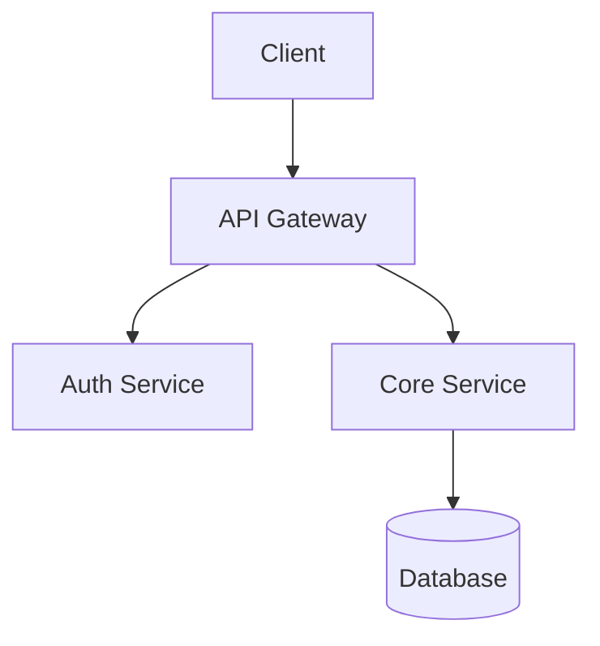

# Bopeep — Repository Architecture Extraction Agent Skill

> "Little Bo Peep has found her sheep" — Bopeep herds scattered codebases into structured, reproducible specifications.

## Purpose

Bopeep is an agent skill that analyzes any software repository — regardless of size, language, or complexity — and produces a complete set of structured `.md` specification files. These files contain enough architectural detail, patterns, conventions, and deployment configuration for another agent to faithfully recreate the project from scratch.

**Input:** A repository path (local) or URL (remote).  
**Output:** A `bopeep-spec/` directory containing structured markdown files.

---

## Design Principles

1. **Scale-agnostic** — Works on 10-file scripts and million-line monorepos alike. Uses chunked analysis with progressive refinement.
2. **Language/framework-agnostic** — Detects stack, doesn't assume it. Handles polyglot repos.
3. **Reproducibility-focused** — Output is prescriptive, not descriptive. Tells an agent *what to build*, not *what was observed*.
4. **Layered detail** — High-level architecture first, drill into modules, then into patterns. An agent can work top-down.
5. **Idempotent** — Re-running Bopeep on same repo produces consistent output. Changes tracked via diffing.

---

## Analysis Phases

Bopeep operates in 6 sequential phases. Each phase produces one or more output files. Phases are designed so earlier phases inform later ones, and large repos can checkpoint between phases.

### Phase 1: Reconnaissance

**Goal:** Understand repo shape without reading code.

**Actions:**
- Count files, directories, total LOC
- Detect languages (file extensions, shebang lines)
- Identify build/config files (package.json, Cargo.toml, go.mod, Makefile, Dockerfile, etc.)
- Map directory tree (depth-limited for large repos, full for small)
- Detect monorepo patterns (workspaces, lerna, nx, turborepo, bazel)
- Identify VCS metadata (git history depth, branch count, contributor count)
- Detect CI/CD config files (.github/workflows, .gitlab-ci.yml, Jenkinsfile, etc.)
- Estimate repo complexity tier: `small` (<50 files), `medium` (50-500), `large` (500-5000), `massive` (5000+)

**Output:** `01-reconnaissance.md`

**Scaling strategy:** File counting and extension scanning is O(n) on filesystem — no context window pressure. For massive repos, directory tree truncated to 3 levels with file counts per directory.

---

### Phase 2: Stack & Dependency Analysis

**Goal:** Identify all technologies, frameworks, and external dependencies.

**Actions:**
- Parse all manifest/lock files (package.json, requirements.txt, Gemfile, go.sum, pom.xml, etc.)
- Categorize dependencies: runtime, dev, build, test, optional
- Identify framework(s) and version constraints (React 18, Django 4.2, Spring Boot 3.x, etc.)
- Detect language versions (.nvmrc, .python-version, .tool-versions, rust-toolchain.toml)
- Identify infrastructure dependencies (databases, message queues, caches, object stores)
- Map internal dependency graph (for monorepos: which packages depend on which)
- Detect code generation tools (protobuf, GraphQL codegen, OpenAPI generators)

**Output:** `02-stack-and-dependencies.md`

**Scaling strategy:** Manifest files are small — read all of them. For monorepos, process each workspace's manifests in parallel. Aggregate into unified dependency map.

---

### Phase 3: Architecture Mapping

**Goal:** Identify architectural patterns, component boundaries, and data flow.

**Actions:**
- Classify architecture style:
  - Monolith / modular monolith / microservices / serverless / hybrid
  - MVC / MVVM / hexagonal / clean architecture / event-driven / CQRS / pipes-and-filters
  - Client-server / SPA+API / SSR / SSG / hybrid rendering
- Map service/module boundaries:
  - Entry points (main files, route definitions, handler registrations)
  - Module/package structure and encapsulation boundaries
  - API surface (REST endpoints, GraphQL schema, gRPC services, CLI commands)
- Identify data layer:
  - Database schemas (migrations, ORM models, raw SQL)
  - Data access patterns (repository pattern, active record, query builders, raw queries)
  - Caching strategy
  - State management (frontend: Redux/Zustand/signals; backend: session stores)
- Map integration points:
  - External API calls (HTTP clients, SDK usage)
  - Message queue producers/consumers
  - Webhook handlers
  - File I/O patterns
- Identify cross-cutting concerns:
  - Authentication/authorization approach
  - Logging/observability instrumentation
  - Error handling strategy
  - Middleware/interceptor chains
  - Configuration management (env vars, config files, feature flags)

**Output:** `03-architecture.md`

**Scaling strategy:** This is the most context-intensive phase. Strategy by repo size:
- **Small/Medium:** Read entry points, route files, models, and key modules. Usually fits in context.
- **Large:** Sample-based analysis. Read directory structures per module, then selectively read key files (entry points, route definitions, model definitions, config). Use grep for pattern detection (decorator usage, import patterns, middleware registration).
- **Massive:** Hierarchical decomposition. First map top-level modules/services. Then analyze each module independently (can parallelize with sub-agents). Cross-reference integration points between modules. Never attempt to read entire codebase — budget ~20 key files per module.

---

### Phase 4: Pattern & Convention Extraction

**Goal:** Capture coding patterns, naming conventions, and structural templates that define "how this codebase does things."

**Actions:**
- **Naming conventions:**
  - File naming (kebab-case, PascalCase, snake_case, co-location patterns)
  - Variable/function/class naming patterns
  - Directory naming conventions
- **Structural patterns:**
  - Component/module template (what does a typical module look like?)
  - File organization within modules (index barrel files, co-located tests, etc.)
  - Import ordering conventions
- **Code patterns:**
  - Error handling idiom (Result types, try/catch style, error codes, Either)
  - Async patterns (async/await, promises, callbacks, channels, actors)
  - DI/IoC approach (constructor injection, container, manual wiring)
  - Validation approach (schema validation, decorators, manual checks)
  - Serialization/deserialization patterns
- **Testing patterns:**
  - Test organization (co-located, separate tree, both)
  - Test naming conventions
  - Fixture/factory patterns
  - Mock/stub approach
  - Integration vs unit test separation
  - Coverage requirements or configuration
- **API patterns:**
  - Request/response shape conventions
  - Error response format
  - Pagination approach
  - Versioning strategy
- **Type system usage:**
  - Strictness level (strict TypeScript, mypy strict, etc.)
  - Custom type patterns (branded types, newtypes, opaque types)
  - Generic/template usage patterns

**Output:** `04-patterns-and-conventions.md`

**Scaling strategy:** Pattern extraction works by sampling. Read 3-5 representative files per detected pattern category. Grep for common idioms. Cross-validate across modules for consistency vs intentional deviation.

---

### Phase 5: Infrastructure & Deployment

**Goal:** Capture everything needed to deploy and operate the system.

**Actions:**
- **Containerization:**
  - Dockerfile analysis (base images, multi-stage builds, layers)
  - Docker Compose / container orchestration configs
  - Image registries referenced
- **Orchestration:**
  - Kubernetes manifests (deployments, services, ingress, configmaps, secrets)
  - Helm charts / Kustomize overlays
  - Terraform / Pulumi / CloudFormation / CDK definitions
  - Serverless configs (serverless.yml, SAM templates, Vercel/Netlify config)
- **CI/CD:**
  - Pipeline definitions (stages, jobs, triggers)
  - Build steps and artifacts
  - Test automation in pipeline
  - Deployment strategy (blue/green, canary, rolling, recreate)
  - Environment promotion flow (dev → staging → prod)
- **Environment configuration:**
  - Environment variables (names, not values — extract from .env.example, docker-compose, CI config)
  - Secrets management approach (vault, AWS secrets manager, sealed secrets, etc.)
  - Feature flag system
- **Observability:**
  - Monitoring setup (Prometheus, Datadog, CloudWatch, etc.)
  - Logging configuration (structured logging, log levels, aggregation)
  - Tracing instrumentation (OpenTelemetry, Jaeger, etc.)
  - Alerting rules
- **Networking:**
  - Service mesh configuration
  - Load balancer setup
  - DNS configuration patterns
  - TLS/certificate management

**Output:** `05-infrastructure-and-deployment.md`

**Scaling strategy:** Infrastructure files are typically few and self-contained. Read all Dockerfiles, CI configs, and IaC files. For large Terraform/K8s directories, map module structure first, then read key modules.

---

### Phase 6: Reproduction Blueprint

**Goal:** Synthesize all prior phases into an actionable, ordered build plan.

**Actions:**
- Generate ordered task list for recreating the project
- Group tasks by dependency (what must exist before what)
- Identify critical path (minimum viable skeleton)
- List explicit decision points (where the original repo made a choice another agent should replicate)
- Include verification steps (what to check after each phase of recreation)
- Note any detected anti-patterns or tech debt (marked as "replicate as-is" vs "known issue")

**Output:** `06-reproduction-blueprint.md`

**Scaling strategy:** Synthesis phase — reads only the outputs of phases 1-5, not the source repo. No scaling concern.

---

## Output File Structure

```
bopeep-spec/
├── 00-index.md                      # Table of contents + metadata
├── 01-reconnaissance.md             # Repo shape, size, languages
├── 02-stack-and-dependencies.md     # Technologies, frameworks, deps
├── 03-architecture.md               # System design, components, data flow
├── 04-patterns-and-conventions.md   # Code style, idioms, templates
├── 05-infrastructure-and-deployment.md  # DevOps, CI/CD, infra
├── 06-reproduction-blueprint.md     # Ordered build plan
├── diagrams/                        # Mermaid diagrams (embedded in .md files too)
│   ├── architecture-overview.mmd
│   ├── data-flow.mmd
│   ├── dependency-graph.mmd
│   └── deployment-topology.mmd
└── modules/                         # Per-module deep-dives (large repos only)
    ├── module-auth.md
    ├── module-api.md
    ├── module-worker.md
    └── ...
```

---

## Output Format Standards

Each output file follows this structure:

```markdown
---
bopeep_version: "1.0"
phase: <phase_number>
repo: <repo_name>
analyzed_at: <ISO-8601 timestamp>
complexity_tier: <small|medium|large|massive>
---

# <Phase Title>

## Summary
<!-- 2-3 sentence overview -->

## Details
<!-- Structured content specific to this phase -->

## Confidence Notes
<!-- What Bopeep is uncertain about — sampled vs exhaustive, ambiguous patterns, etc. -->

## Reproduction Instructions
<!-- Specific, actionable steps for an agent recreating this aspect -->
```

### Diagram Standards

All architectural diagrams use Mermaid syntax for portability:



Diagrams embedded inline in relevant `.md` files AND saved as standalone `.mmd` files in `diagrams/`.

---

## Scaling Strategy Summary

| Repo Size | Files | Strategy | Estimated Phases |
|-----------|-------|----------|-----------------|
| Small | <50 | Read everything. Single-pass analysis. | All in 1 agent pass |
| Medium | 50-500 | Read key files. Grep for patterns. | 2-3 agent passes |
| Large | 500-5000 | Sample-based. Module-by-module. Parallel sub-agents for Phase 3-4. | 4-6 agent passes |
| Massive | 5000+ | Hierarchical decomposition. Top-level mapping first, then per-service/module sub-agents. Heavy grep usage. | 8+ agent passes, parallelized |

### Large Repo Tactics

1. **File budget per phase:** Never read more than ~100 files in a single agent context. Prioritize entry points, configs, and models.
2. **Grep over read:** When looking for patterns, grep first, then selectively read matching files.
3. **Directory-as-signal:** Directory names and structure carry architectural intent. Map structure before reading contents.
4. **Module decomposition:** For large repos, Phase 3 spawns sub-agents per module. Each produces a `modules/module-<name>.md` file. Parent agent synthesizes.
5. **Progressive refinement:** First pass = skeleton. Second pass = fill gaps. Third pass = cross-reference and verify.
6. **Checkpointing:** Each phase writes its output before next phase begins. If interrupted, resume from last completed phase.

---

## Agent Skill Interface

### Invocation

```
/bopeep <repo_path> [options]
```

### Options

| Option | Default | Description |
|--------|---------|-------------|
| `--depth` | `full` | Analysis depth: `quick` (phases 1-2), `standard` (phases 1-5), `full` (all phases) |
| `--output` | `./bopeep-spec` | Output directory for spec files |
| `--modules` | auto | Comma-separated module names to analyze (large repos). `auto` = detect all. |
| `--resume` | - | Resume from a specific phase number |
| `--diff` | - | Path to previous bopeep-spec. Output only changes. |
| `--focus` | - | Focus areas: `architecture`, `patterns`, `deployment`, `all` |

### Examples

```bash
# Full analysis of local repo
/bopeep ./my-project

# Quick recon of large monorepo
/bopeep ./mega-corp-monorepo --depth quick

# Analyze only the auth and api modules
/bopeep ./microservices --modules auth,api

# Resume interrupted analysis from phase 4
/bopeep ./my-project --resume 4

# Generate diff against previous spec
/bopeep ./my-project --diff ./bopeep-spec-v1
```

---

## Skill Definition (Agent Configuration)

```yaml
name: bopeep
description: >
  Analyze any repository and produce structured specification files
  that capture architecture, patterns, conventions, and deployment
  configuration. Output is designed to be consumed by another agent
  to faithfully recreate the project.
version: "1.0.0"
author: "Trusted Methods"

triggers:
  - "/bopeep"
  - "analyze this repo"
  - "extract architecture"

capabilities_required:
  - file_read
  - file_write
  - glob
  - grep
  - bash (git log, wc, find for counting)
  - sub_agent_spawn (for large repo parallelization)

context_management:
  max_files_per_pass: 100
  checkpoint_after_each_phase: true
  parallel_module_analysis: true
  
output:
  format: markdown
  directory: bopeep-spec
  diagrams: mermaid
```

---

## Error Handling & Edge Cases

| Scenario | Behavior |
|----------|----------|
| Binary-heavy repo (assets, compiled code) | Skip binary files. Note their presence and purpose in recon. |
| Generated code (protobuf, codegen) | Identify generator config. Document generation process, not generated output. |
| Vendored dependencies | Detect vendor dirs. Document vendoring approach, skip vendored code analysis. |
| Git submodules | Document submodule references. Analyze submodule repos separately if `--depth full`. |
| Encrypted/obfuscated files | Note presence. Skip analysis. Flag in confidence notes. |
| Empty/stub files | Note presence. May indicate planned-but-unimplemented features. |
| Multiple languages in same service | Document polyglot nature. Analyze each language's patterns separately. |
| No clear entry point | Use heuristics: main files, index files, exported modules. Flag uncertainty. |
| Conflicting patterns | Document both patterns with locations. Note potential inconsistency vs intentional variation. |

---

## Success Criteria

Bopeep output is successful when:

1. **Completeness:** An agent reading only the bopeep-spec files (no access to original repo) could recreate a project with the same architecture, patterns, and deployment topology.
2. **Accuracy:** Architecture descriptions match actual code structure. No hallucinated components.
3. **Actionability:** Every section includes concrete reproduction instructions, not just observations.
4. **Scaleability:** Analysis completes in reasonable time/cost for repos up to 100K+ files.
5. **Confidence transparency:** Uncertain areas clearly marked. Sampling strategy documented.

---

## Future Extensions (Out of Scope for v1)

- **Live analysis mode:** Watch file changes, update spec incrementally
- **Cross-repo analysis:** Map dependencies between multiple repos
- **Migration spec:** Generate spec for migrating from one stack to another
- **Compliance overlay:** Flag security/compliance patterns and gaps
- **Interactive refinement:** Agent asks clarifying questions when ambiguous patterns detected
